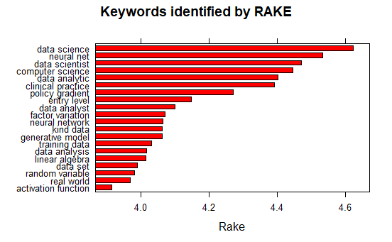
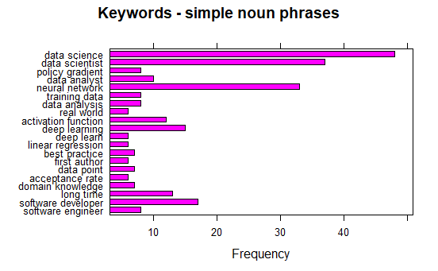

# data_607_project_3

## Data Science Skills Analysis Overview

This repo is for the purpose of using basic natural language processing to to find the most in demand data science skills by collecting information from data science reddit and stack overflow forums. Using a combination of packages fro web scraping and text analysis we collected, organized, and analyzed unstructured text data with the goal of extracting the most relevant data science skills.

## Data Collection

**Reddit**

We used a python package called praw for extracting information from five different subreddits related to data science. We collected the first 100 posts and all the comments related to each post. 

Subreddits
- datascience 
- datasciencejobs 
- machinelearning 
- learnmachinelearning        
- learndatascience
- machinelearningjobs

**Stack Overflow**

We also collected information from a web hosted xml file with that includes text from recent data science job postings on stack overflow.

**Data Storage**

To stored the data we used a free Amazon RDS PostgresSQL account. We created to two tables, one for each data source each containing the raw text separated by it source and type.

|Stack Overflow Data|Data Type Description|
|:------|:----------|
|Skills|list of all the skills across the job postings|
|Freq| number of times the skill appears in the job posted|

|Reddit Data|Data Type Description|
|:------|:----------|
|Title| The title of the post|
|Body| text from original post|
|Sub| which subreddit is came from|
|Post ID| unique identifier we for each post|
|comment| text from all comments related to the post|

## Analyis

**Tidying**

Combine all the data from the comments into one cell and add it to each reddit post as it's own variable. We removed uneccessary columns. The merged data set contains the title of the post, the body, the sub-reddit it belongs to, the post id, and all of the corresponding comments.Make a document term matrix from the comments in the dataset. The parameters minDocFreq and maxDocFreq are use to filter out overly common words, so we can identify keywords we are looking for. Created a POS tagger using udpipe, so that we can identify different parts of speech and analyze the most frequent words.

**Conclusion**

The analysis of the Reddit posts was for the most part successful.  We were able to identify many keywords related to Data Science, but not all of them would be considered skills.  The data we gathered from the XML files is more directly related to skills, as they were taken directly from job listings.  In conclusion, both data sources were useful but it is more difficult to single out skills alone from a large database of text with many different Data Science related topics.

## Contributors

Kevin Potter  
Justin Hsi  
Vincent Miceli  
Bruno de Melo
